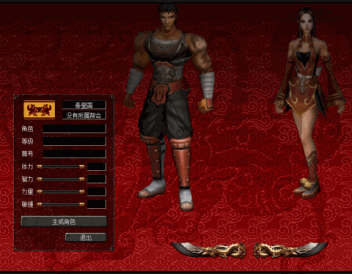

# Metin2 old experience
2005 Metin2 Client studies.
The client used is the 2005 Chinese BETA Client.

Old page containing setup file names for the 2003 CBT Client: http://web.archive.org/web/20030204230121/http://www.metin2.com/download_1.html

2004 Second stage CBT Client (Torrent) : magnet:?xt=urn:btih:0c6202579de5f5fe663fda897cd10dfa482f5fce&dn=METIN2_0192.exe&tr=http%3a%2f%2f211.39.157.122%3a6969%2fannounce

Will include a 2005 server emulator once I can get to the game phase.

Chinese beta client contains 3 characters in selectphase and
there are only 4 jobs (Warrior Male, Sura Male, Ninja Female, Shaman Female)

File "MetinBT-0192": 2nd stage torrent client
Patch "Enable logfile": Enables debug logging (log.txt) and Console
Patch "NoMyevankey": Disables pseudorandom XTEA key implemented in 2005 by MyEvan
  With this patch the client will rely on the old hardcoded XTEA key probably used in Ymir locales (KR from 2004)

Select Phase working:

Suspects:
- Direct login from Game core (input_login.cpp) or Login method 1 (No keys supplied when loggin in / SendLoginPacket) might be used
 before the 2005 Chinese client.

@todo: 2003/2004 articles and screenshots
@todo: IDA analysis of 2005 client (locale.inf, font registration, locale...)
@todo: Forcepatch SendLoginPacket old to Game server? (GameServer.cs)
@todo: After selectphase handling? (GameServer.cs Packet_Login3.cs)
