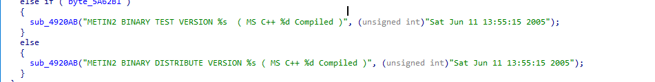
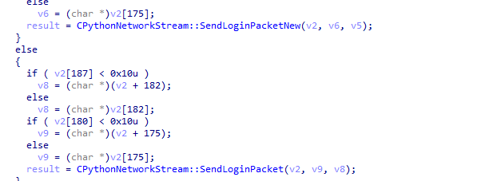
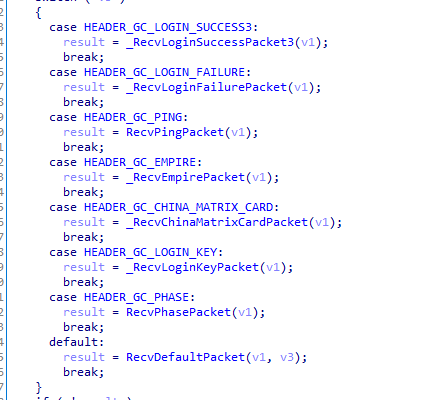

# Metin2 old experience
Metin2 history and client studies.

## Client study (2005 Chinese CBT Client)
Client timestamp: (pass /timestamp as argument)

Mysterious patch.bin reference (not referenced in leaked srcs):

The client contains 3 character slots in SelectPhase.

There are only 4 jobs. (Warrior Male, Sura Male, Ninja Female, Shaman Female)

Interesting switch to set the default fonts, apperently it supported EU fonts?

The XTEA hardcoded korean key

is not used in this version as with any client after 2005?

MyEvan crypt functionalities:

Matrix card is present in this build, suggesting it might have been
used first in this client (catv.net BETA client)

As my suspect, LoginPacketNew is present (and used) in this version,
perhaps it was only really used in 2004 or 2003 beta.

Login phase:

Handshake phase:

Inside the folder 2005Catv I've dropped some files, more info in that readme.

## Dead links
- First stage 2003 CBT Client (KR) setup file names: http://web.archive.org/web/20030204230121/http://www.metin2.com/download_1.html
- Second stage 2004 CBT Client (KR) {note: no seeders + MetinBT-0192 is the downloader}: `magnet:?xt=urn:btih:0c6202579de5f5fe663fda897cd10dfa482f5fce&dn=METIN2_0192.exe&tr=http%3a%2f%2f211.39.157.122%3a6969%2fannounce`

## File infos
- File "MetinBT-0192": 2nd stage torrent client
- Patch "Enable logfile": Enables debug logging (log.txt) and Console
- Patch "NoMyevankey": Disables pseudorandom XTEA key implemented in 2005 by MyEvan
  With this patch the client will rely on the old hardcoded XTEA key probably used in Ymir locales (KR from 2004)

## Screenshots
2005 SelectPhase working

## Suspects
- Direct login from Game core (input_login.cpp) or Login method 1 (No keys supplied when loggin in / SendLoginPacket) might be used
 before the 2005 Chinese client.

## TODO
- @todo: 2003/2004 articles and screenshots
- @todo: Forcepatch SendLoginPacket old to Game server? (GameServer.cs)
- @todo: After selectphase handling? (GameServer.cs Packet_Login3.cs)

## Other
- 说明 - manual.txt: Translated manual of 2009 rain files release

## Reference articles for old metin2 (up to 2005)
@todo!
